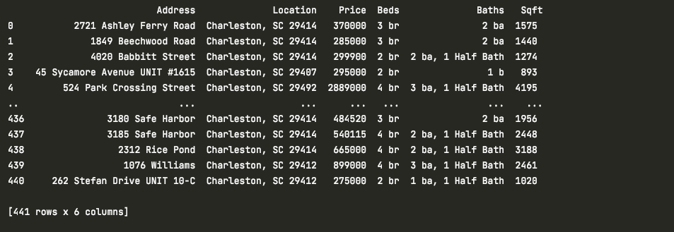
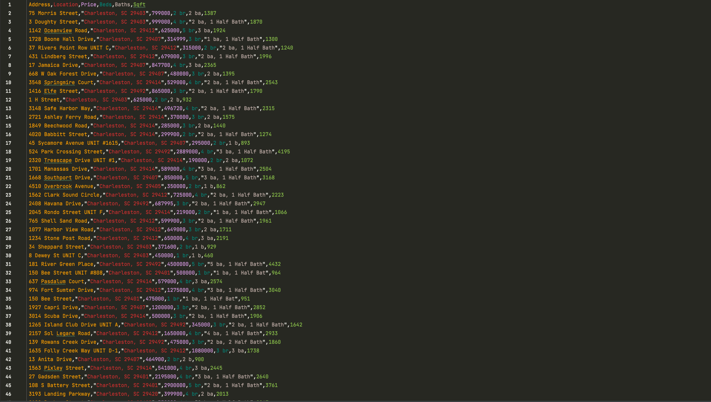
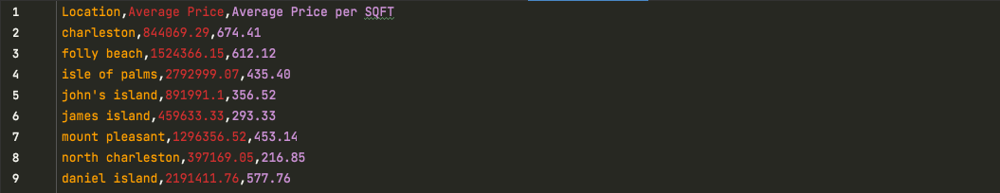
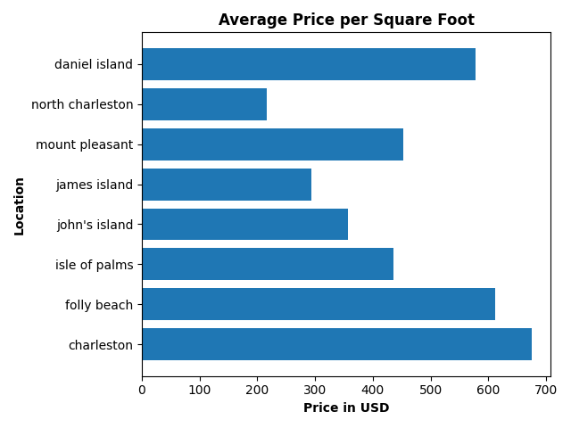

# python-real-estate-scraper
web scraping project to grab listing data and compare home prices.

# Prerequisites
- [Python](https://www.python.org)
- [requirements.txt](https://github.com/joytantrum/python-real-estate-scraper/blob/main/requirements.txt)


# Set up
download & install python 3 from the official site.

run the following in the terminal to install required libraries: 
```bash
  pip3 install -r requirements.txt
```

download the source code from the repository and run as a .py file.
```bash
  python3 MAIN_SCRAPER.py
```


# How it works
This scraper class grabs listing data from the [Marshall Walker](https://www.marshallwalker.com/) real estate agency website. I initally wrote this class to include the most popular towns in the Charleston area, but more data can be scraped by adjusting the towns parameter. 

To scrape data from your chosen location, adjust the town parameter in the main function. 

To create the pandas dataframe of your chosen location, call the create_dataframe() method. Your output should look like this:
<p align="center">
  
</p>

To write the chosen town's listing data to a CSV file, call the write_to_csv() method with your chosen file name as the parameter. Your csv file should look something like this:
<p align="center">
  
</p>

To write the chosen town's average data to a CSV file, call the avg_data_to_csv() method. The file is automatically named AVG_DATA.csv within the method. 
To append a new line of average data (stored as a dictionary in the constructor) to the same CSV file, call the add_to_avg() method. Adjust the X variable within the method to apply your chosen location. Fill this CSV file with all the data you wish to examine in a matplotlib bar graph.

Your AVG_DATA.csv file should look something like this:
<p align="center">
  
</p>

To create a bar graph of the average home prices, call the avg_price_graph() method. Your output shoud look like this:
<p align="center">
  
</p>

To create a bar graph of the average price per square foot, call the avg_price_perSQFT_graph() method. Your output shoud look like this:
<p align="center">
  
</p>


# Credits
This project uses several open source packages and libraries:
- [Pandas](https://pandas.pydata.org/docs/getting_started/install.html)
- [Matplotlib](https://matplotlib.org/stable/users/installing/index.html)
- [BeautifulSoup](https://pypi.org/project/beautifulsoup4/)
- [CSV](https://pypi.org/project/python-csv/)
- [Requests](https://pypi.org/project/requests/)

